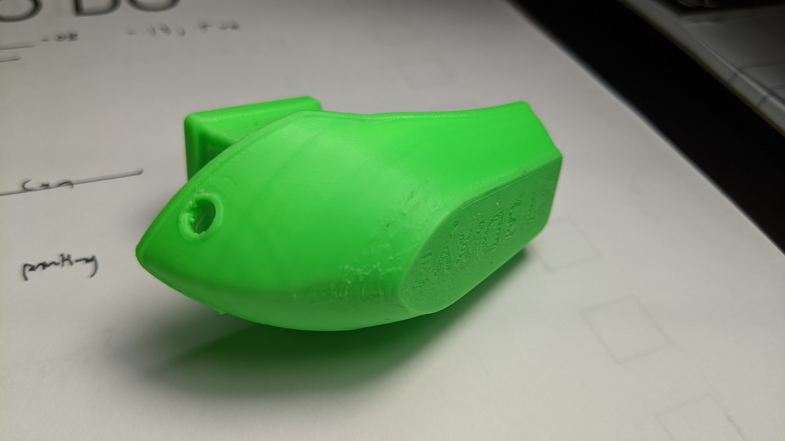
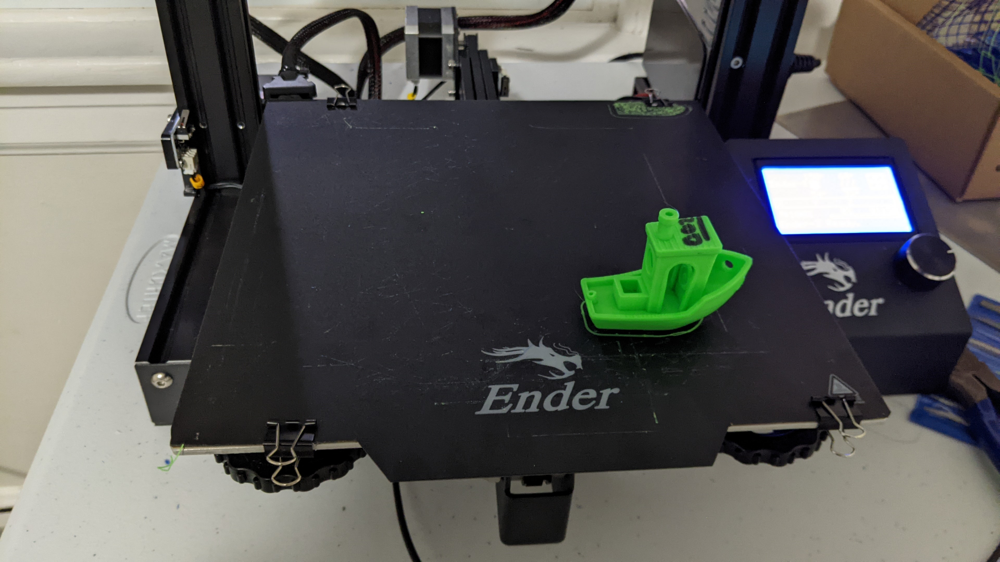

[za3k](/) > 3d printing > testing 3d printer settings

All the below prints use the popular [3D benchy](stl/3dbenchy.stl) test object

### Print 001

Print Time: 4h12m45m (vs 4h11m estimated)

Print Quality: Very High

Material: "ELEGOO" PLA+ Neon Green

Settings (from [gcode](001/3dbenchy_4h11m_0.08mm_210C_PLA_ENDER3.gcode)
):

    ( initial nozzle warmup + wipe enabled )

    ( prusa-slicer, octopi )

    ; nozzle_diameter = 0.4

    ; filament_settings_id = "Prusament PLA @CREALITY"
    ; bed_temperature = 60
    ; temperature = 210

    ; skirt_height = 2
    ; support_material = 0
    ; brim_width = 0

    ; layer_height = 0.08
    ; bridge_speed = 25
    ; external_perimeter_speed = 25
    ; deretract_speed = 40
    ; first_layer_speed = 20
    ; first_layer_speed_over_raft = 30
    ; infill_speed = 50
    ; max_print_speed = 100
    ; perimeter_speed = 40
    ; retract_speed = 60
    ; retract_length = 5
    ; support_material_speed = 40
    ; travel_speed = 150
    ; top_solid_infill_speed = 30
    ; infill_every_layers = 1

Issues present:
1. bottom of the roof looking a bit bad
1. roughness on the bottom half of the hull, becomes visible only at the nose
1. layer misalignment/indents near top of side doors, all the way around
1. minor strings hanging in the front holes, off the smokestack
1. something (dirt?) embedded in the bottom hole
1. printed letters on the stern not visible--this is a printer limitation. minor bump instead
1. small gap with slanted stern pipe
1. first-layer squashing--letters not distinct

### Print 002, 003

Print Time: N/A

Print Quality: Failed

Material: "ELEGOO" PLA+ Neon Green

Moved the print, changed to 0.2mm layer height.

Print failed--seemed to be moved off the bed. Extrusion stopped out of the nozzle, cause unknown.

### Print 003:
(Cancelled)

### Print 004:

Print 004 is a test with 0.2mm layer height to speed up printing.

Print 005 is identical to 005, except shifted on the print bed. It's a test of multiple prints on one bed, queued in Octopi
