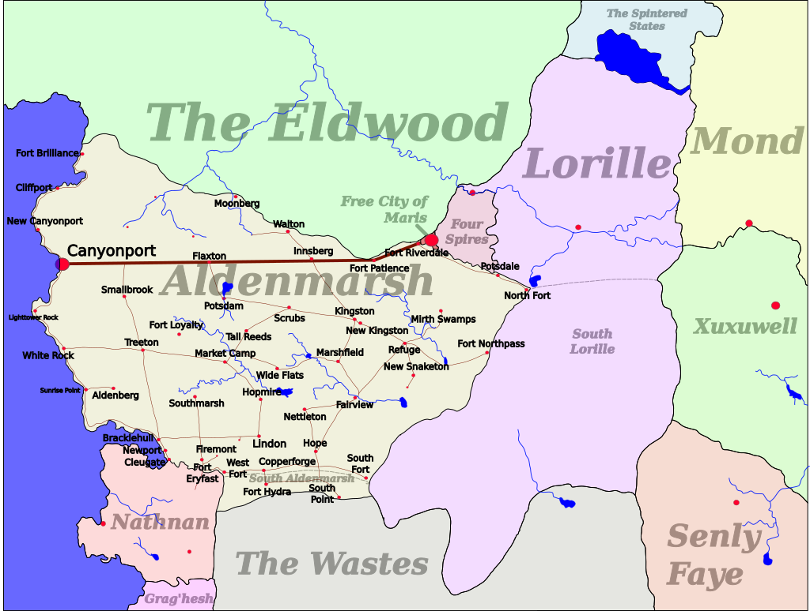

#Country, Aldenmarsh
## Map

## Facts
**Population**: 500,000

**Capital City**: [Canyonport](canyonport.md)

**Climate**: Tropical

**Geography**: Rolling and flat wetlands

**Languages**: Aldish and Common

**Exports**: Mechanical and skilled goods, textiles, gemstones, rice, paper and books

**Imports**: Food, stone, metal, labor, crude metalwork, weapons and armor

**Economy**: Trade taxes and exports

**Species**: Mixed. Mostly shorter-lived species like humans.

**Laws**: Standard, but with strict penalties, especially for repeat offenders. [Divination](divination.md) is punishable by death.

**Government (actual)**: Theocracy by the Church of Baneth

**Government (nominal)**: Council composed of representatives from the Church of Baneth, guilds, and the noblility

**Bordering nations (clockwise)**: [Magic Sea](magic_sea.md), [Eldwood](eldwood.md), [Maris](maris.md), [Four Spires](four_spires.md) (+ Lanolis River), [Lorille](lorille.md), [The Wastes](wastes.md), [Nathnan Barony](nathnan.md)

## About
The southernmost part of Aldenmarsh, called South Aldenmarsh, is part of the [Wastes](wastes.md). It's plataeu with only a handful of forts on it. It's also claimed by Nathnan and Lorille, but there hasn't been any armed conflict over it. The land has no value, no people living there, and all the people currently living there are from Aldenmarsh (or the wastes).

## Economy
Aldenmarsh, through Canyonport, controls trade across the entire Magic Sea through trade agreements. Between its economic power, and position near the Lanolis River, most trade goods travelling by water on the continent pass through Canyonport, and Aldenmarsh taxes them. Aldenmarsh uses [silver currency](coins.md).

## Culture
Aldenmarsh is the cultural center of the Magic Sea. Heavy influences from the Church of Baneth. Education and virtue are instilled by free and mandatory education from Gardeners. Church service is mandatory. Outside religion is closely regulated and censured, but permitted if practitioners regularly swear oaths of faith to Baneth. Citizens care strongly about proper procedures and sophistication. Faith, virtue, reading, and gardening are considered high culture. Gardens, quality textiles, elaborate mechanical devices, or rare books might be shown as signs of wealth.

There is a general mistrust of foreigners and foreign influence. Foreign workers must wear local clothing, speak only Common or Aldish, stay in the Foreign Quarter in Canyonport at night. Foreigners are are not permitted to stay long-term, and immigration is exceptional. Foreign goods and food are common, foreign customs and phrases are not.
