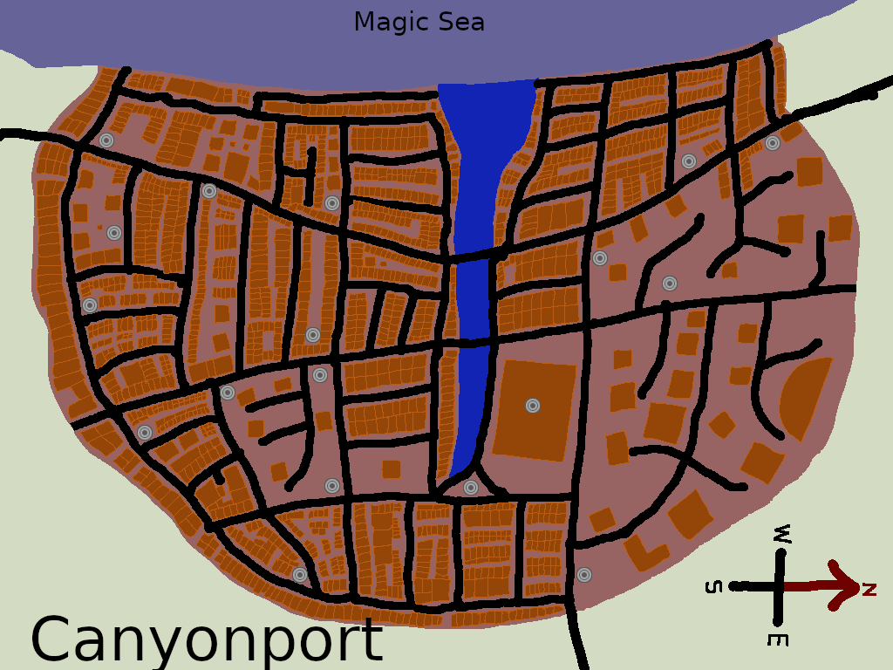

[za3k](/) > [aldenmarsh](/aldenmarsh) > [maps](maps.md) > canyonport

#City, Canyonport
## Map

## Facts
Also known as: "The Green City", aka "New Ja'goth"

**Population**: 350,000

**Government**: See [Aldenmarsh](aldenmarsh.md)

## About
Canyonport is a trading port with a still, deep river running through the middle of it, joining the unnaturally pure Magic Sea on one end. It is covered in plants--gardens run every street, and ornamental rooftop gardens are common. Symbols of Baneth are displayed everywhere. People on the street are friendly, but social classes rarely mingle. Canyonport is a busy trade town, and there are mechants, shops, and restaurants everywhere. Public entertainment and sermons are commonplace. The city is quiet and still soon after dusk.
