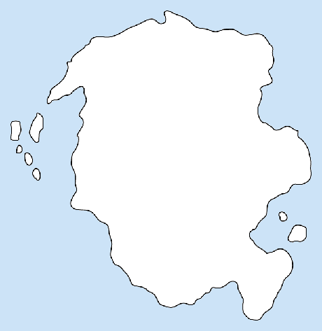
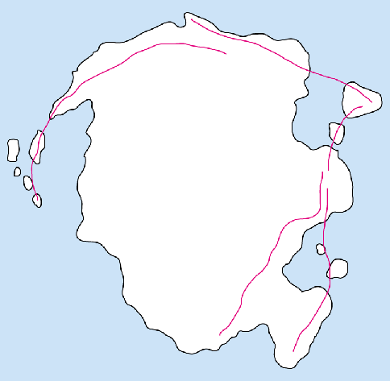
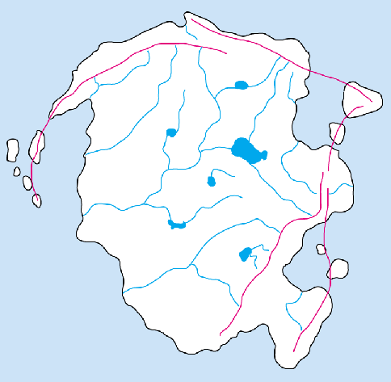
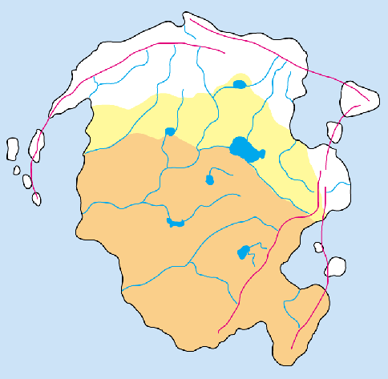
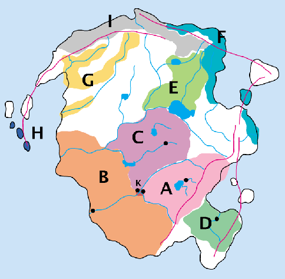

[za3k](/) > [archive](/archive) > [rich burlew's articles](/richburlew) > the new world, part 6: geography

### The New World, Part 6: Geography
by Rich Burlew - originally from [GiantITP.com](https://www.giantitp.com/)

Time to finally talk a little about what the world actually looks like. Keep in mind that much of what I'm about to say is a gross oversimplification of real earth science, but it's good enough for our purposes.

To start, I know a few things about how I want games set in this world to feel. I want there to be a lot of overland travel, rather than travel by boat, because I want the feel that places you need to sail to are distant and exotic. I also want the possibility of major land wars, complete with cavalry and such. All of the major factions need to be able to try to invade one another without crossing any major body of water. Plus, many of the world's nations were once part of a continuous empire, one that was held together for at least two generations.

These all lead to the same conclusion: one large continent upon which all of the nations exist. Rather than being centered around a sea or ocean, the civilizations will cover one large land mass, and contact with other land masses will be scarce. In fact, I'm not even going to draw other continents on my map; let them be the purview of individual DMs, should they ever wish to expand the world. So I draw the following basic shape:

You'll notice I am already using a basic guideline for drawing realistic land masses: peninsulas usually lead to islands. In fact, that is really just a corollary of a bigger guideline, which I'll call "Elevation determines everything." What does that mean? It means that every aspect of natural geography can be derived from the height above or below sea level. Actually, elevation itself is partly determined by the movement and position of tectonic plates, so it should be called "Tectonic plates determine everything," but frankly, the players will never encounter tectonic plates. Thus I just cheat that part and start with elevation.

So, how do I determine geography using elevation? First, try to think of the planet not as land and water, but as simply land, like a big bumpy patch of ground. If you then pour water onto that bumpy ground, parts of it will immediately be submerged, while other parts will stay dry; the water will flow down to seek the lowest regions. Those regions will be the seas and oceans, and the paths the water takes to get from the highland to the lowland are the rivers. If you think about it carefully, you'll realize that there are places where the water flows in and covers much of the region but not the highest points, creating islands.

Mountains usually form when two plates (the giant masses that form the planet's crust) crash against one another. They thus tend to form in lines, representing the borders between two plates. This is important, because mountains in vaguely linear shapes are a lot more believable when you look at them; think of the Appalachians, or the Andes for examples. Another important point is that these linear forms will tend to be parallel to coastlines. After all, a coastline is nothing more than the point where the elevation becomes high enough to break the water's surface.

Mountains can't be parallel to ALL coastlines, though, so what happens when they meet the ocean? Usually peninsulas, and thereafter, islands. The mountains become lower and lower until water starts to flood between each peak. By this point, they are hardly recognizable as "mountains" per se, but they are still elevated land, at least compared to the ocean floor.

But remember, I'm partly working backwards. I know, for example, that Kingdom D needs to be separated by mountains, and I know that Kingdom A needs a lot of hills and mountains for mining. I know that I want nearby islands with shallow water for my faux-Vikings. So I'll draw in to my maps "peak lines," representing the paths of the highest elevations. (They are the lines in magenta.) After seeing them, I see that they converge in the northeast, so logic says there should be some more islands over there. I add them, and my map now looks like this:

This is working out well: I have a huge flat open area to serve as the seat of civilization. I'm starting to picture South America, with a ring of mountains and an extensive river system, only with a more temperate climate. Let's add rivers next, then, because they make the best borders and are virtually a prerequisite for city placement. Rivers, as mentioned, flow from the highest peak to the sea, always seeking the lowest land along the way. Smaller rivers will flow into larger rivers; rivers only "split" if you are traveling upstream. I draw rivers in to the map, concentrating on the major ones; I assume there are more tiny streams and rivers than I would even be able to map.

I added a few lakes, too, because lakes are great settings that are underused in fantasy gaming, in my opinion. Lakes are important in tales of Arthur (Lady of the Lake, anyone?) and kind of have a European connotation that I like. There aren't many lakes in other settings that I've seen, either, so sure, what the hell; this world has a lot of lakes.

Time to sketch in our kingdoms. First, I'll shade in the area that was controlled by the old empire at the height of its power (yellow shading). This area was held with naked force, though, and the edges of it represent how far the armies ever conquered. During the reign of the first emperor's son, the empire contracted to those regions they could safely and securely defend (orange shading). This is a crucial point, because it explains how there can be people of "barbarian" nature within the kingdoms. So the history map looks like this:

Now we divide up the old empire into kingdoms. Reviewing our story from Part 5, we know that the eldest son chose a mountainous and mineral-rich area; that looks like the southeast part of the empire. The middle child, the daughter, went with the trading ports; clearly, those would be on the main rivers, giving her the western coastline. The area in the northeast of the empire has lots of rivers and lakes, so that would be prefect for the youngest son's rich farmlands. Kingdom D, the breakaway, goes far into the southeast, on that peninsula, separated from A & B by the mountains. Interestingly, this means that it shares no borders with its ally, Kingdom C, which strikes me as great fodder for adventuring as couriers from C to D must pass through enemy territory to deliver messages. I like it a lot.

How about the nations that were never part of the empire? As they are organized by blood ties rather than geography, we'll draw them with very irregular borders. One will hug the coastline (F), while another only inhabits river valleys (G). One (E) will butt right up against Kingdom C; that's the most peace-loving kingdom, after all, and we can't have them all peaches and cream. Let them fend off the barbarians at the big lake. And the faux-Vikings end up on the islands (H). Oh, and the gnolls (J) need a good chunk of territory at the very northernmost reaches; I like the idea of them being arctic and barbaric.

Finally, I'll draw in the church-states (K). Their location is now obvious: the point where all three major Kingdoms touch, at the fork in the river. I'll block in roughly the capital cities for each kingdom; the "free" tribes don't really have central seats of authority.

For now, that's good enough. I still need to define the exact terrain types for each region (forests, mountains, hills, plains) but that can come later, when I am ready to make a final map. This is enough for me to continue to flesh out the setting without tying me down to tightly to a specific geography.
